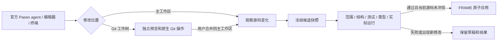

# Paseo 创作工作区

FRAME 使用完整的官方 Paseo WebUI 和 daemon。原生会话、消息回执、流式回答、权限请求、文件编辑器、终端和 Git 操作由 Paseo 负责。FRAME 提供作品范围、素材与画面引用、实时预览、验证和应用结果。

集成固定官方 `v0.10.2`、源码提交 `919c737c1948c5a16220307403a82e90d3e27ea0`。平台补丁保存在 `integrations/paseo/patches/`，官方插件源码在 `integrations/paseo/frame-plugin/`；共享桥接契约以 `shared/bridge.ts` 为源，服务器使用可在 Node 22.13 及以上加载的生成文件 `bridge.mjs`。

## 用户操作

1. 打开作品的 Paseo 创作区，选择原生 agent 和提供商。每个作品拥有自己的工作环境和持久原生历史。
2. 在 FRAME 选择画面、片段、镜头或素材后，通过“引用当前画面与素材”加入原生附件；发送时冻结引用。发送失败后重试保留同一消息 ID 和原始引用。
3. 在主工作区修改当前作品源码。文件编辑器、终端和 Git 的修改都通过相同的草稿观察和验证通道；不要求由 AI 回合结束才能发现变化。
4. 查看实时预览与验证结果。主草稿只有通过范围、项目结构、测试、类型及短片段实际画面和音频检查后才可应用；验证失败保留草稿与错误信息。
5. 使用原生 Git 工作树时，在该工作树内创作并选择对应 agent 预览。完成后通过官方 Git 操作合并回主工作区，再由 FRAME 验证和应用。FRAME 不自动合并隔离分支。

主草稿和原生工作树可以各自预览。原生工作树预览会显示来源身份；预览、导出或素材引用不会替你把工作树合并到正式作品。



## AI 使用方法

在原生 agent 的当前工作目录执行：

```sh
node scripts/work-tool.mjs context
node scripts/work-tool.mjs capabilities
```

先读取 `context.authority`、项目入口与当前范围，再修改 `projects/<id>/`。公共引擎接口、动画绝对时间、多轨音频和资源 URL 规范继续遵循 [AUTHORING.md](AUTHORING.md) 与 [AI-WORKFLOW.md](AI-WORKFLOW.md)。完整能力目录和过滤方法见 [CAPABILITIES.md](CAPABILITIES.md)。

原生 agent 的 FRAME 工具凭据绑定这个作品及准确 agent；工具按该 agent 的已验证工作目录读取源码。主工作区与经过 Git 注册校验的本作品工作树均可使用工具。不要把另一个 agent 的目录或作品当成当前修改目标。

### 冻结画面与素材

原生文本附件包含发送时的画面时间、范围、镜头、素材 SHA-256 与项目路径。实时引用使用唯一会话 ID 和源码 revision，服务器解析实际来源；客户端自报提交号或目录不能替换可信快照。

冻结的源码位置为：

```text
/frame-references/messages/<messageUUID>/source
/frame-references/messages/<messageUUID>/manifest.json
```

本地环境使用 `$FRAME_REFERENCE_ROOT/messages/<messageUUID>/`。该目录只读，提供源码和资源清单，不额外复制完整音视频。当前素材仍通过项目 `public/` 和 FRAME 素材工具访问。

修改前对照冻结源码与当前草稿。旧时间码对应旧画面；不得直接把旧引用重新解释成更新后的场景。重试保留同一消息 ID、上下文、提供商和模型选择，不跟随播放器后来移动的位置。

原生消息回执优先处理恢复：完全相同的已完成消息直接恢复结果，不再次发送；结果未知的 pending 回执显示待核对状态。尚无回执时，服务器在准备发送的原子步骤核对首次冻结的原生 provider/model；选择已经变化会明确拒绝发送，原冻结消息仍保留。不要通过换消息 ID 绕过这个提示。

### 预览资源模式

- **原始素材**：媒体不转码；浏览器读取原素材并处理声音和画面。
- **压缩素材**：按需复用服务器媒体代理，独立于画面质量选择。
- **全部缓存**：浏览器下载和校验清单中的原素材、模块及运行资源，显示进度和待下载文件；更新后下载新 revision，播放读取已校验缓存。

预览的代码构建、鉴权和不可变安全快照继续由 FRAME 管理。正式导出使用原始媒体。细节见 [V8-LIVE-PREVIEW.md](V8-LIVE-PREVIEW.md)。

## 提供商与历史

FRAME 提供商在官方原生选择器中显示为作品可用 profile。公开配置只有标签、模型和非秘密元数据；所选连接的凭据在 `agent.session_open` 时解析，进入专用 home 和该原生 session 的环境。不会把 FRAME vault、master key 或所有连接凭据挂进作品环境。官方、自定义或 ACP 原生 profile 保留其原生配置方式。

同一作品的 agent 共享作品环境的操作系统用户和可写范围；它们不是彼此独立的系统权限沙箱。不同作品使用独立环境。HTTP/HTTPS 由部署入口决定，集成不额外强制独立域名或 TLS。

嵌入页面的会话与深链接使用当前请求的实际协议、主机和端口，支持本机 HTTP、反向代理 HTTPS 及访问别名，无需为 Paseo 另行填写域名。反向代理沿用平台的转发协议/主机头；`FRAME_PUBLIC_URL` 仍用于平台规范链接，不作为 Paseo 访问白名单。不同访问源的浏览器状态分别保存，作品、会话 nonce 与对应 iframe 的校验继续生效。

旧 FRAME 对话和任务历史保留并可只读查看，不再从旧聊天入口发送新消息。当前接续方式是把有界旧历史摘要加入新原生会话，同时保留旧记录入口；不会删除旧历史。当前未提供经过验证的旧 provider session 导入，也不声称能恢复该 session 的执行状态。

## 持久化与维护

Paseo 集成元数据使用独立 `paseo_schema_migrations` ledger 和新增的 bindings、message contexts、candidates 表。核心作品、素材和旧 PostgreSQL 历史不重写、不删除。旧应用可以忽略新增集成表；回滚不能靠删除这些持久数据实现。

daemon 空闲不占用永久“活动任务”。真正模型回合、权限等待、工作中的终端和未确定原生状态影响停止及应用判断。终端 activity 无法确定时，自动应用会等待；请在官方终端界面关闭该终端，再继续应用。候选验证按作品串行，过时结果不会覆盖新草稿。正式作品应用复用 FRAME 的源码 CAS、发布记录与恢复 journal，失败重试不会重新调用模型。
