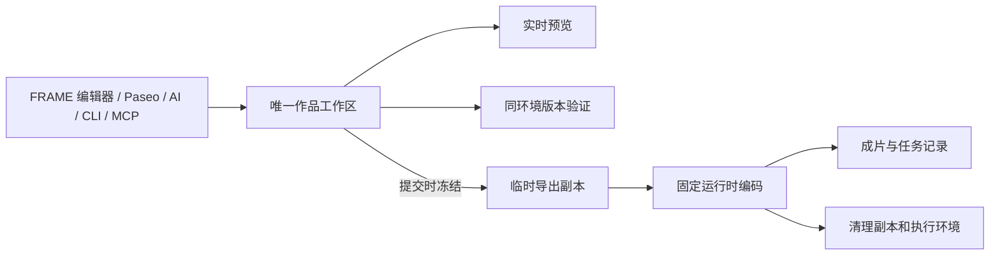

# Paseo 创作工作区

FRAME 使用完整官方 Paseo WebUI 和 daemon。原生会话、消息回执、流式回答、权限请求、文件编辑器、终端和 Git 操作由 Paseo 负责。FRAME 提供作品工具、素材和实际画面引用、实时预览及版本验证。产品需求见 [AI 工作台](AI-WORKBENCH.md)。

集成固定官方 `v0.10.2`、源码提交 `919c737c1948c5a16220307403a82e90d3e27ea0`。补丁在 `integrations/paseo/patches/`，插件源码在 `integrations/paseo/frame-plugin/`；共享桥接契约以 `shared/bridge.ts` 为源，服务器加载生成的 `bridge.mjs`。候选镜像验证源码、补丁、插件、锁定依赖和产物指纹。

## 使用

1. 打开作品，选择提供商并新建或继续原生对话。多个标签页和多个对话复用此作品唯一运行环境。
2. 文件编辑器、终端、AI、FRAME 编辑器、CLI 和 MCP 都修改作品当前目录。保存后实时预览直接更新，无需应用草稿或选择预览来源。
3. 在作品页选择实际画面、片段、镜头或素材，用原生输入栏的“引用作品”加入附件。发送时冻结引用和原生消息 UUID。
4. 验证报告标记所检查的源码 revision。结构、项目测试、类型及短片段真实画面和声音检查在同一作品环境执行；过时结果不能代表新源码，失败保留修改和错误。
5. “在新标签页打开 Paseo”保留当前对话路由，直接打开完整页面。独立页面复用相同会话、daemon 和目录；没有播放器时不填入虚构的位置或素材，作品工具仍正常使用。

每个作品只有一份持久可编辑源码。Paseo 不提供额外工作树创作入口。作品自身的 Git 分支及 FRAME/Paseo Git 操作共用同一 checkout、HEAD 和 index；其他作品仍独立。关闭工作面板保持原生页面挂载，不中止工作。



## 作品工具与引用

在原生 Agent 当前目录执行：

```sh
node scripts/work-tool.mjs context
node scripts/work-tool.mjs capabilities
```

先读 `context.authority`、项目入口与范围，再编辑 `projects/<id>/`。公共接口、绝对时间、多轨音频和资源 URL 遵循 [AUTHORING.md](AUTHORING.md)、[AI-WORKFLOW.md](AI-WORKFLOW.md) 与 [CAPABILITIES.md](CAPABILITIES.md)。作品凭据绑定这个作品及实际 Agent，工具解析到同一目录。

发送的文本附件包含画面时间、范围、镜头、素材 SHA-256 和路径。实时引用绑定实际已显示的源码及编译资源版本，不把旧时间码重新解释成新画面。只读对照目录：

```text
/frame-references/messages/<messageUUID>/source
/frame-references/messages/<messageUUID>/manifest.json
```

本地使用 `$FRAME_REFERENCE_ROOT/messages/<messageUUID>/`。对照保留源码与资源清单，媒体按已记录内容身份读取，不创建另一份可编辑工作区。

完全相同的已完成原生回执恢复结果，不重复发送；结果未知时保留待核对状态。尚未投递的消息再次发送时核对冻结提供商和模型，选择变化须恢复原选择或明确创建新消息。

## 运行环境与导出

作品根目录只读复用固定版本公共引擎、依赖和工具。Docker 内 `/workspace` 和作品实际路径指向同一 checkout；Git common metadata 挂载到原绝对路径，避免另建 index。日常验证复用这个容器，不创建候选副本或验证容器。

后台 MP4 在请求被接受时冻结已保存源码、原素材、运行时镜像与参数。排队和编码期间继续编辑不影响成片，导出不会回写作品。成功产物确认后立即清理源码、混音/编码临时文件和执行容器；失败、取消、超时和重启恢复也核对身份后清理。下载、保留期限和 Releases 上传保护独立于临时工作区。WebM 锁定播放器实际显示的版本，结束后恢复最新预览。

原始素材、压缩素材和全部缓存模式见 [V8 实时预览](V8-LIVE-PREVIEW.md)。编译产物和媒体代理属于有预算的缓存，不构成权威源码。

## 提供商与持久化

FRAME 连接在原生选择器显示为可用 profile。公开配置只有名称、模型和非秘密元数据，凭据在 `agent.session_open` 解析并提供给所选 session。保留原生自定义 profile 和当前回合。同作品 Agent 共享环境和可写范围；不同作品独立运行。

嵌入和独立页面使用当前请求的实际协议、主机和端口，支持本机 HTTP、反向代理 HTTPS 及访问别名，不增加域名或 TLS 配置。平台登录、作品 nonce 与对应 iframe 的桥接校验继续生效。

Paseo 用独立 `paseo_schema_migrations` 管理 bindings、冻结消息和 revision 验证报告。作品、素材、提供商凭据、原生 Paseo 会话及 Git 历史保留。旧 FRAME 聊天、旧 AI 任务、专用令牌、问答、通知与旧执行目录全部移除，不再提供旧历史入口。

升级会先比较历史 Paseo 草稿和工作树与当前源码。不同内容明确标记需处理并保留，不自动覆盖或删除；相同旧副本不作为创作来源。一次性旧 AI 清理使用 `node scripts/clear-legacy-ai.mjs`，只删除迁移 journal 中核对身份的旧目录和已停止容器，不删除卷或其他作品。此迁移删除旧 schema 后不能启动旧版应用作为回滚。
